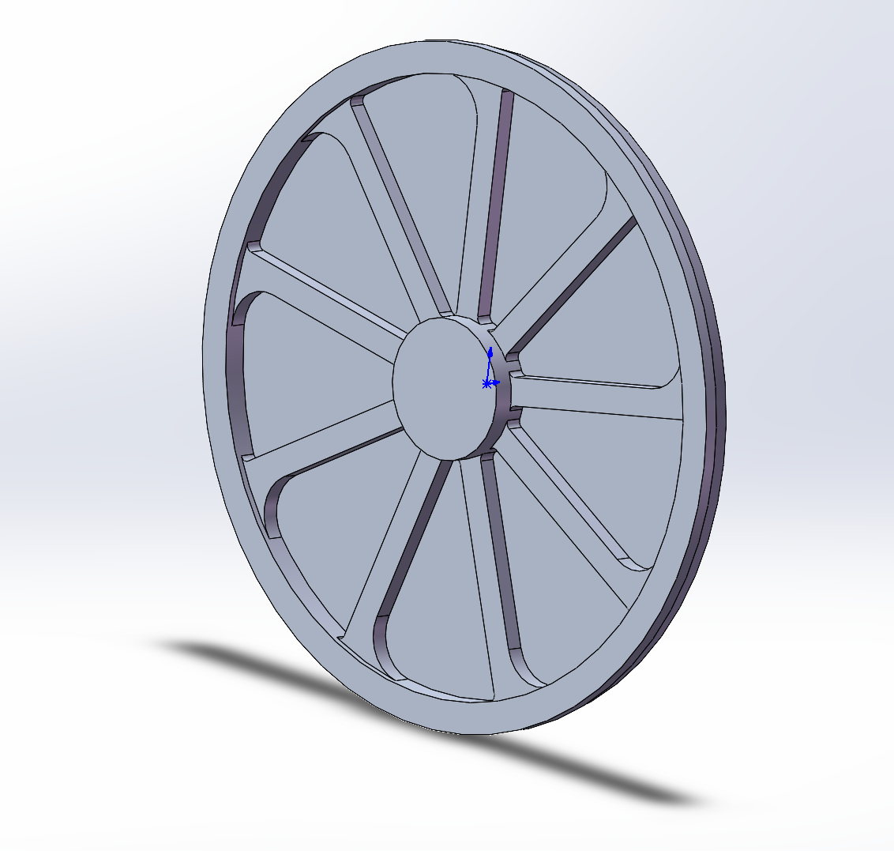

# Parts

## 1. Bracket v1

- Features: Extrude, Cut, Fillet, Slot
- Description: Basic structural part for SolidWorks practice
- 

## 2. Wheel v1

- Features: Revolve, Circular Pattern
- Description: Symmetry and pattern practice

