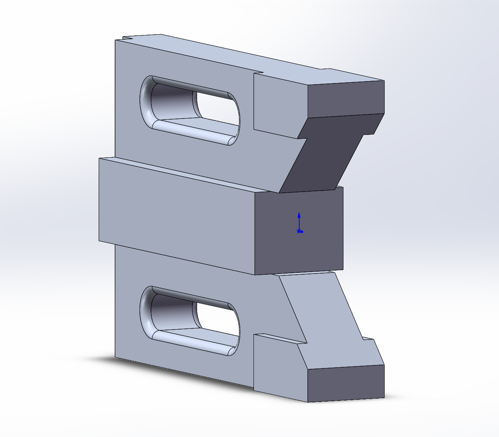
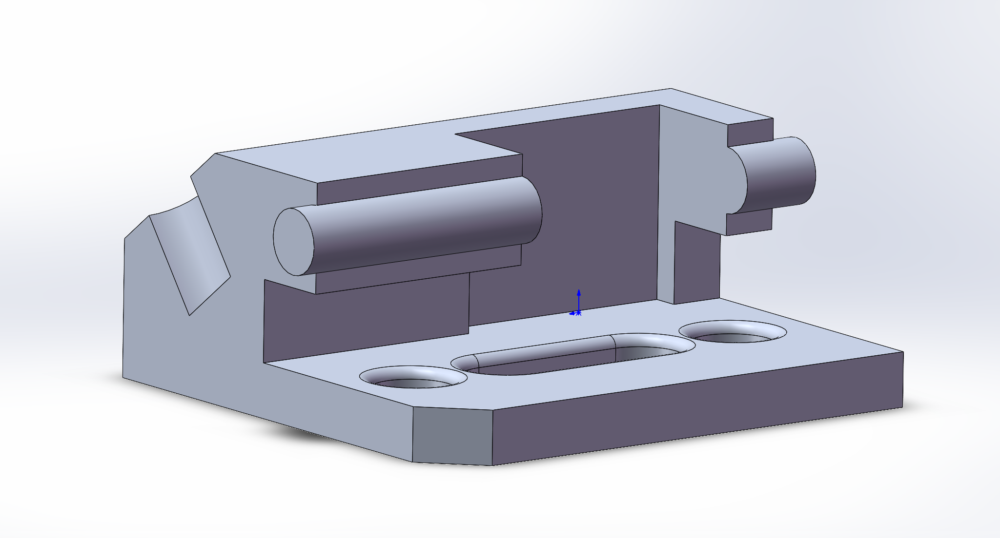

# Parts

## 1. Bracket v1

- Features: Extrude, Cut, Fillet, Slot
- Description: Basic structural part for SolidWorks practice
- 

## 3. Bracket v2

- Features: Multi-feature, Slot, Complex structure
- Description: More advanced structural part closer to real engineering component

